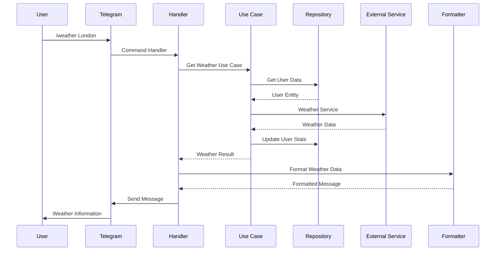
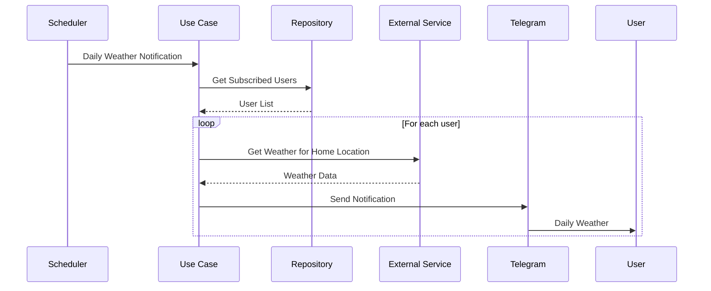

# Telegram Weather Bot Architecture

## Table of Contents

1. [Introduction](#introduction)
2. [Architecture Overview](#architecture-overview)
3. [Clean Architecture Layers](#clean-architecture-layers)
4. [Component Diagram](#component-diagram)
5. [Data Flow](#data-flow)
6. [Directory Structure](#directory-structure)
7. [Design Patterns](#design-patterns)
8. [Key Components](#key-components)
9. [Dependencies](#dependencies)
10. [Testing Strategy](#testing-strategy)

## Introduction

This document describes the architecture of the Telegram Weather Bot project. The bot is built following Clean Architecture principles, emphasizing separation of concerns, testability, and maintainability. The architecture ensures that business logic remains independent of external frameworks and services.

## Architecture Overview

The project implements Robert C. Martin's Clean Architecture with four main layers:

```
┌─────────────────────────────────────────┐
│              Presentation               │  ← External Interface
├─────────────────────────────────────────┤
│             Infrastructure              │  ← Framework & Drivers
├─────────────────────────────────────────┤
│              Application                │  ← Use Cases
├─────────────────────────────────────────┤
│           Core (Domain + Entities)      │  ← Enterprise Business Rules
└─────────────────────────────────────────┘
```

### Dependency Rule

Dependencies flow inward only:
- **Core** has no dependencies
- **Application** depends on Core
- **Infrastructure** depends on Application and Core
- **Presentation** depends on all layers

## Clean Architecture Layers

### 1. Core Layer (`weatherbot/core/`)

**Enterprise Business Rules** - Contains the most general and high-level rules.

- **Entities**: Core business objects
- **Value Objects**: Immutable data structures
- **Domain Exceptions**: Business rule violations
- **Configuration**: Application configuration management

```python
# Example: Core entities
class User:
    def __init__(self, telegram_id: int, language: str = "en"):
        self.telegram_id = telegram_id
        self.language = language
        self.home_location: Optional[Location] = None
        self.is_subscribed: bool = False
```

### 2. Domain Layer (`weatherbot/domain/`)

**Application Business Rules** - Contains application-specific business rules.

- **Interfaces/Ports**: Abstract definitions for external services
- **Domain Services**: Complex business operations
- **Repository Interfaces**: Data access abstractions

```python
# Example: Repository interface
class UserRepository(ABC):
    @abstractmethod
    async def get_user(self, telegram_id: int) -> Optional[User]:
        pass
    
    @abstractmethod
    async def save_user(self, user: User) -> None:
        pass
```

### 3. Application Layer (`weatherbot/application/`)

**Use Cases** - Contains application-specific use cases and orchestrates the flow.

- **Use Cases**: Application business logic
- **Services**: Application services
- **DTOs**: Data Transfer Objects

```python
# Example: Use case
class GetWeatherUseCase:
    def __init__(self, weather_service: WeatherService, user_repo: UserRepository):
        self._weather_service = weather_service
        self._user_repo = user_repo
    
    async def execute(self, telegram_id: int, location: str) -> WeatherData:
        user = await self._user_repo.get_user(telegram_id)
        return await self._weather_service.get_weather(location, user.language)
```

### 4. Infrastructure Layer (`weatherbot/infrastructure/`)

**Framework & Drivers** - Contains implementations of interfaces defined in inner layers.

- **External Services**: Third-party API implementations
- **Repositories**: Data persistence implementations
- **Container**: Dependency injection setup
- **Configuration**: External configuration loading

### 5. Presentation Layer (`weatherbot/presentation/`)

**Interface Adapters** - Converts data between use cases and external formats.

- **Formatters**: Data presentation logic
- **Keyboards**: Telegram inline keyboards
- **Internationalization**: Multi-language support

### 6. Handlers Layer (`weatherbot/handlers/`)

**Controllers** - Handle external requests and coordinate responses.

- **Command Handlers**: Process Telegram commands
- **Message Handlers**: Process text messages and locations
- **Callback Handlers**: Handle button interactions

## Component Diagram

```mermaid
graph TB
    TG[Telegram API] --> H[Handlers]
    H --> UC[Use Cases]
    UC --> DS[Domain Services]
    UC --> R[Repositories]
    UC --> ES[External Services]
    
    ES --> OM[Open-Meteo API]
    ES --> NOM[Nominatim (OpenStreetMap) API]
    R --> FS[File System Storage]
    
    H --> F[Formatters]
    F --> I18N[Internationalization]
    
    UC --> E[Entities]
    DS --> E
    
    subgraph "Core Layer"
        E
        CO[Configuration]
        EX[Exceptions]
    end
    
    subgraph "Application Layer"
        UC
        AS[Application Services]
    end
    
    subgraph "Infrastructure Layer"
        ES
        R
        DI[DI Container]
    end
    
    subgraph "Presentation Layer"
        F
        I18N
        K[Keyboards]
    end
    
    subgraph "Handlers Layer"
        H
    end
```

## Data Flow

### 1. User Command Flow



### 2. Subscription Notification Flow



## Directory Structure

```
weatherbot/
├── __init__.py
├── __version__.py
├── core/                    # Enterprise Business Rules
│   ├── __init__.py
│   ├── config.py           # Configuration management
│   ├── container.py        # Dependency injection
│   ├── decorators.py       # Common decorators
│   └── exceptions.py       # Domain exceptions
├── domain/                 # Application Business Rules
│   ├── __init__.py
│   └── repositories.py     # Repository interfaces
├── application/            # Use Cases
│   ├── __init__.py
│   ├── subscription_service.py
│   ├── user_service.py
│   └── weather_service.py
├── infrastructure/         # Framework & Drivers
│   ├── __init__.py
│   ├── external_services.py   # API clients
│   ├── json_repository.py     # JSON storage implementation
│   ├── setup.py              # Infrastructure setup
│   ├── spam_protection.py    # Rate limiting
│   ├── spam_service.py       # Spam detection
│   └── state.py              # Application state
├── presentation/           # Interface Adapters
│   ├── __init__.py
│   ├── formatter.py        # Message formatting
│   ├── i18n.py            # Internationalization
│   └── keyboards.py        # Telegram keyboards
├── handlers/               # Controllers
│   ├── __init__.py
│   ├── admin_commands.py   # Admin command handlers
│   ├── commands.py         # User command handlers
│   ├── language.py         # Language switching
│   └── messages.py         # Message handlers
├── jobs/                   # Background Jobs
│   ├── __init__.py
│   ├── backup.py          # Data backup
│   └── scheduler.py       # Task scheduling
└── utils/                  # Shared Utilities
    ├── __init__.py
    └── wmo.py             # Weather code mappings
```

## Design Patterns

### 1. Dependency Injection

The application uses a small DI container and registers implementations in
`weatherbot/infrastructure/setup.py`. Below is a representative example of
the actual registration performed by the project:

```python
# infrastructure/setup.py (representative)
def setup_container() -> None:
    config = get_config()
    container.register_singleton(UserRepository, JsonUserRepository(config.storage_path))
    container.register_singleton(WeatherService, OpenMeteoWeatherService())
    container.register_singleton(GeocodeService, NominatimGeocodeService())
    container.register_singleton(SpamProtectionService, LegacySpamProtectionService())

    container.register_factory(UserService, lambda: UserService(container.get(UserRepository)))
    container.register_factory(WeatherApplicationService, lambda: WeatherApplicationService(container.get(WeatherService), container.get(GeocodeService)))
    container.register_factory(SubscriptionService, lambda: SubscriptionService(container.get(UserRepository)))
```

### 2. Repository Pattern

Data access is abstracted through repository interfaces:

```python
class UserRepository(ABC):
    @abstractmethod
    async def get_user(self, telegram_id: int) -> Optional[User]:
        pass
```

### 3. Command Pattern

Telegram commands are handled using command handlers:

```python
async def weather_cmd(update: Update, context: ContextTypes.DEFAULT_TYPE) -> None:
    # Command implementation
    pass
```

### 4. Strategy Pattern

Different formatters for various data presentations:

```python
class WeatherFormatter:
    def format_current_weather(self, weather_data: WeatherData) -> str:
        # Formatting logic
        pass
```

### 5. Decorator Pattern

Cross-cutting concerns like spam protection:

```python
@spam_protection
@admin_required
async def admin_command(update: Update, context: ContextTypes.DEFAULT_TYPE):
    # Command logic
    pass
```

## Key Components

### 1. Configuration Management

```python
@dataclass
class Config:
    bot_token: str
    admin_ids: List[int]
    admin_language: str
    storage_path: str
```

### 2. Weather Service

```python
class WeatherService:
    async def get_current_weather(self, location: str) -> WeatherData:
        # Open-Meteo API integration (default implementation)
        pass
```

### 3. User Management

```python
class UserService:
    async def get_or_create_user(self, telegram_id: int) -> User:
        # User lifecycle management
        pass
```

### 4. Subscription System

```python
class SubscriptionService:
    async def subscribe_user(self, user: User) -> None:
        # Subscription management
        pass
```

### 5. Internationalization

```python
class I18n:
    def get_text(self, key: str, language: str = "en", **kwargs) -> str:
        # Multi-language support
        pass
```

### 6. Spam Protection

```python
class SpamProtection:
    def is_allowed(self, user_id: int) -> bool:
        # Rate limiting logic
        pass
```

## Dependencies

### Core Dependencies

- **python-telegram-bot**: Telegram Bot API wrapper
- **httpx**: Async HTTP client for external APIs
- **python-dotenv**: Environment variable management

### Development Dependencies

- **pytest**: Testing framework
- **pytest-asyncio**: Async testing support
- **black**: Code formatting
- **isort**: Import sorting
- **flake8**: Linting

## Testing Strategy

### 1. Unit Tests

- Test individual components in isolation
- Mock external dependencies
- Focus on business logic

```python
@pytest.mark.asyncio
async def test_get_weather_success():
    # Arrange
    weather_service = Mock()
    use_case = GetWeatherUseCase(weather_service)
    
    # Act
    result = await use_case.execute("London")
    
    # Assert
    assert result.temperature > 0
```

### 2. Integration Tests

- Test component interactions
- Use test doubles for external services
- Verify data flow

```python
@pytest.mark.asyncio
async def test_user_subscription_flow():
    # Test complete subscription workflow
    pass
```

### 3. Architecture Tests

- Verify dependency rules
- Check layer boundaries
- Validate architectural constraints

```python
def test_core_has_no_external_dependencies():
    # Verify core layer purity
    pass
```

### Test Structure

```
tests/
├── conftest.py              # Test configuration
├── test_architecture.py     # Architecture compliance tests
├── test_commands.py         # Command handler tests
├── test_formatter.py        # Formatter tests
├── test_i18n.py            # Internationalization tests
├── test_spam_protection.py  # Spam protection tests
└── test_*.py               # Various other test files
```

## Performance Considerations

### 1. Async/Await Pattern

All I/O operations use async/await for non-blocking execution:

```python
async def get_weather(self, location: str) -> WeatherData:
    async with httpx.AsyncClient() as client:
        response = await client.get(url)
        return response.json()
```

### 2. Connection Pooling

HTTP clients use connection pooling to reduce overhead.

### 3. Caching Strategy

- Weather data caching (short-term)
- User data caching in memory
- Translation caching for i18n

### 4. Resource Management

- Proper context manager usage
- Connection cleanup
- Memory-efficient data structures

## Security Considerations

### 1. Data Protection

- Sensitive configuration in environment variables
- No hardcoded secrets
- Secure data storage practices

### 2. Input Validation

- User input sanitization
- Command parameter validation
- Rate limiting implementation

### 3. Error Handling

- Graceful error recovery
- No sensitive data in error messages
- Comprehensive logging for debugging

## Deployment Architecture

### 1. Single Instance Deployment

```
┌─────────────────┐    ┌─────────────────┐    ┌─────────────────┐
│   Telegram      │    │  Weather Bot    │    │ Open-Meteo      │
│     API         │◄──►│   Application   │◄──►│      API        │
└─────────────────┘    └─────────────────┘    └─────────────────┘
                                │
                                ▼
                       ┌─────────────────┐
                       │  JSON Storage   │
                       └─────────────────┘
```

### 2. Production Considerations

- **Health Checks**: Application monitoring endpoints
- **Logging**: Structured logging with correlation IDs
- **Metrics**: Performance and usage metrics collection
- **Backup**: Automated data backup strategies
- **Monitoring**: Error tracking and alerting

---

This architecture ensures maintainability, testability, and scalability while keeping the codebase clean and following established software engineering principles.