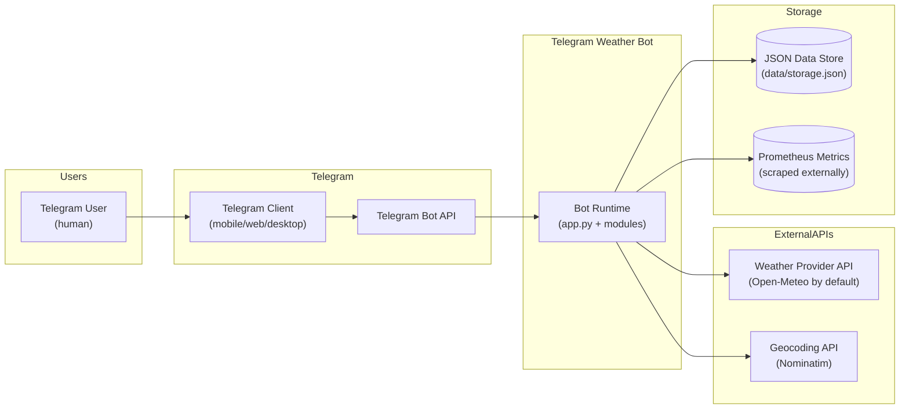
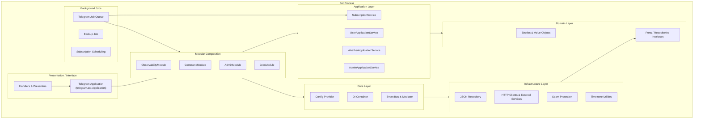
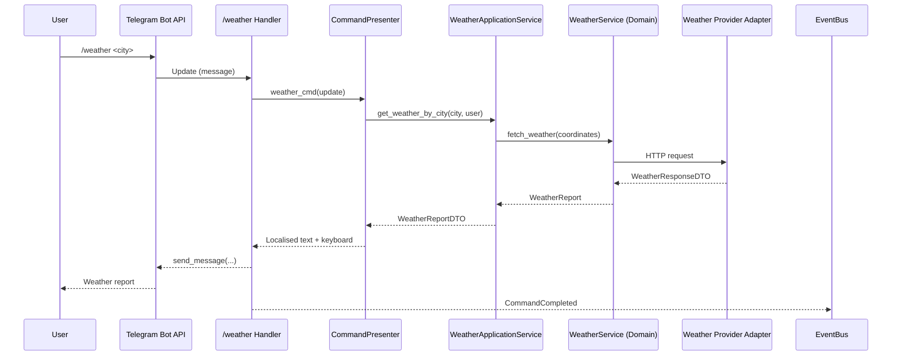
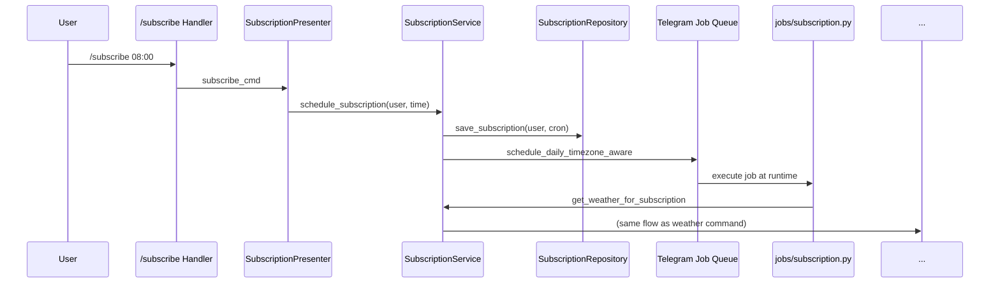
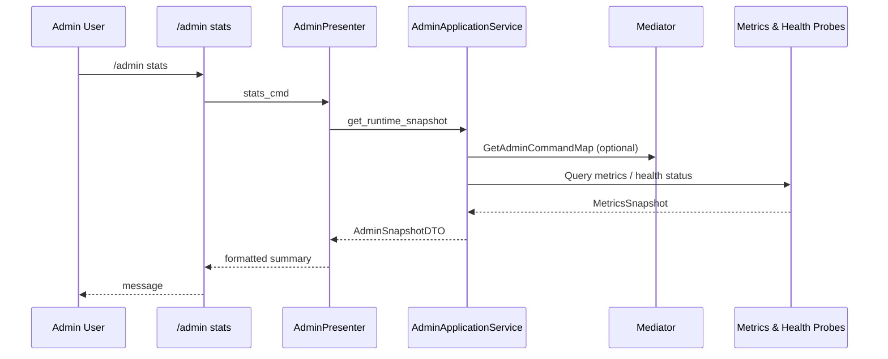

# Telegram Weather Bot Architecture

## Table of Contents

1. [Overview](#overview)
2. [C4 Model](#c4-model)
   1. [Level 1: System Context](#level-1-system-context)
   2. [Level 2: Container View](#level-2-container-view)
   3. [Level 3: Component View](#level-3-component-view)
   4. [Code-Level Building Blocks](#code-level-building-blocks)
3. [Runtime Bootstrap](#runtime-bootstrap)
4. [Layered Design](#layered-design)
   1. [Core Layer (`weatherbot/core/`)](#core-layer-weatherbotcore)
   2. [Domain Layer (`weatherbot/domain/`)](#domain-layer-weatherbotdomain)
   3. [Application Layer (`weatherbot/application/`)](#application-layer-weatherbotapplication)
   4. [Infrastructure Layer (`weatherbot/infrastructure/`)](#infrastructure-layer-weatherbotinfrastructure)
   5. [Presentation & Interface Layer](#presentation--interface-layer)
5. [Modular Composition](#modular-composition)
   1. [Observability Module](#observability-module)
   2. [Admin Module](#admin-module)
   3. [Command Module](#command-module)
   4. [Jobs Module](#jobs-module)
6. [Cross-Cutting Services](#cross-cutting-services)
   1. [Dependency Injection Container](#dependency-injection-container)
   2. [Configuration Management](#configuration-management)
   3. [Event Bus & Mediator](#event-bus--mediator)
   4. [Conversation State & Spam Protection](#conversation-state--spam-protection)
   5. [Localization & Presentation Helpers](#localization--presentation-helpers)
7. [Background Processing & Scheduling](#background-processing--scheduling)
8. [Persistence & External Integrations](#persistence--external-integrations)
9. [Data Flow Walkthroughs](#data-flow-walkthroughs)
   1. [Weather Command Sequence](#weather-command-sequence)
   2. [Subscription Lifecycle](#subscription-lifecycle)
   3. [Admin Telemetry Flow](#admin-telemetry-flow)
10. [State & Data Management](#state--data-management)
11. [Testing Strategy](#testing-strategy)
12. [Developer Onboarding Guide](#developer-onboarding-guide)
   1. [Getting Started Checklist](#getting-started-checklist)
   2. [Extending Functionality](#extending-functionality)
   3. [Architecture Decision Tracking](#architecture-decision-tracking)
13. [Observability & Operations](#observability--operations)
14. [Glossary & Further Reading](#glossary--further-reading)

---

## Overview

Telegram Weather Bot is built around an asynchronous clean architecture that separates business rules, application workflows, and infrastructure concerns. The project emphasises:

- **Deterministic composition**: Modules assemble the bot at start-up, making features opt-in and order-aware.
- **Dependency inversion**: All services are resolved through a small dependency injection container.
- **Async-first execution**: External calls, storage access, and Telegram handlers use `asyncio` to keep the bot responsive.
- **Testability**: Every layer communicates through protocols, keeping business logic independent from infrastructure.
- **Observability by design**: Metrics, health checks, structured logging, and tracing are wired in from the bootstrap sequence.

```
┌─────────────────────────────────────────────┐
│             Presentation & Handlers         │  Telegram-facing adapters
├─────────────────────────────────────────────┤
│           Modules & Application Services    │  Orchestration & use cases
├─────────────────────────────────────────────┤
│      Domain Entities, Value Objects, Ports  │  Business rules
├─────────────────────────────────────────────┤
│   Infrastructure & Cross-cutting Services   │  External providers & storage
└─────────────────────────────────────────────┘
```

The sections below provide multiple architectural viewpoints (context, container, component, and code) so that developers of any experience level can orient themselves quickly.

## C4 Model

The C4 model gives a consistent way to document software architecture at different levels of abstraction. The diagrams use Mermaid syntax so they render in GitHub and other Markdown viewers.

### Level 1: System Context



**Key takeaways**

- The bot is a single deployable process interacting with Telegram and external services.
- Persistent state is file-based by default but can be swapped via infrastructure adapters.
- Operational tooling (metrics/health) runs inside the bot and is scraped externally.

### Level 2: Container View



**Key takeaways**

- Modules bridge the Telegram application and underlying services.
- The dependency injection container keeps wiring centralized while respecting clean boundaries.
- Background jobs run in the same process but are orchestrated by the modules.

### Level 3: Component View

```mermaid
flowchart LR
    subgraph CommandModule
        HandlerSetup["handlers/command_handlers.py<br/>configure_command_handlers"]
        PresenterFactory["presentation/presenters.py<br/>CommandPresenter"]
        SubscriptionFlow["jobs/subscription.py<br/>Subscription helpers"]
    end

    subgraph ApplicationServices
        UserService
        WeatherApplicationService
        SubscriptionService
        AdminApplicationService
    end

    subgraph DomainLayer
        ConversationStateManager
        WeatherServicePort
        SubscriptionRepositoryPort
        SpamProtectionService
    end

    subgraph InfrastructureAdapters
        JsonUserRepository
        OpenMeteoAdapter
        NominatimAdapter
        SpamProtectionAdapter
        TimezoneAdapter
    end

    HandlerSetup --> PresenterFactory
    PresenterFactory --> ApplicationServices
    ApplicationServices --> DomainLayer
    DomainLayer --> InfrastructureAdapters
```



**Key takeaways**

- Handlers never talk to infrastructure directly; they delegate to presenters and application services.
- Domain ports make infrastructure swappable (e.g., replace the JSON repository with PostgreSQL by implementing the same protocol).
- Presenters mediate between raw domain results and Telegram-friendly responses.

### Code-Level Building Blocks

- **Protocols** (PEP 544 typing) define contracts between layers.
- **Value Objects** provide immutability and validation for user profiles, locations, and weather data.
- **Decorators** (`weatherbot.core.decorators`) add cross-cutting concerns (rate limiting, localization) without polluting core logic.
- **Module Loader** sequences bootstrap hooks so that dependencies are ready before handlers start running.

## Runtime Bootstrap

The entrypoint `app.py` performs the following steps before the bot starts polling:

1. Load the runtime configuration via `weatherbot.core.config.get_config()`.
2. Build the dependency container with `weatherbot.infrastructure.setup.setup_container()`.
3. Resolve cross-cutting services such as the `EventBus` and `Mediator` from the container.
4. Instantiate the Telegram `Application` and wire modular features through `ModuleLoader`.
5. Run registered module start-up hooks (metrics server, health checks, restoring jobs, …) before starting polling.
6. After the polling loop finishes, invoke registered shutdown hooks to flush metrics, close HTTP clients, and persist state.

This lifecycle keeps bootstrap responsibilities contained in `app.py` while each module contributes its own setup logic.

## Layered Design

### Core Layer (`weatherbot/core/`)

The core layer holds primitives that are reused everywhere:

- **Configuration** (`config.py`): Provides `BotConfig`, a `ConfigProvider`, and environment loading helpers.
- **Dependency container** (`container.py`): A lightweight service locator with factory/singleton registration and context helpers.
- **Events and mediator** (`events.py`): Infrastructure-agnostic event bus and mediator abstractions used for decoupled communication.
- **Decorators** (`decorators.py`): Dependency-aware function decorators (rate limiting, translation helpers) configured at runtime.
- **Exceptions** (`exceptions.py`): Canonical error types shared across layers.

The core layer has no dependencies on other project packages.

### Domain Layer (`weatherbot/domain/`)

Domain objects encode the business vocabulary:

- **Conversation state** (`conversation.py`): In-memory state machine describing chat modes, awaiting states, and location context.
- **Value objects** (`value_objects.py`): Immutable structures such as `UserProfile`, `UserHome`, `SubscriptionEntry`, and spam statistics.
- **Weather model** (`weather.py`): Rich weather data objects and helpers for derived values.
- **Repositories & ports** (`repositories.py`, `services.py`): Abstract interfaces for persistence and external integrations (weather, geocoding, spam protection).

All application services depend on these abstractions instead of concrete implementations.

### Application Layer (`weatherbot/application/`)

Application services orchestrate use cases by combining domain objects and infrastructure:

- **`UserService`** (`user_service.py`): Manages user preferences, language, and home location using the `UserRepository` and `TimezoneService`.
- **`WeatherApplicationService`** (`weather_service.py`): Wraps the domain-level `WeatherService` and `GeocodeService`, returning DTOs suited for presenters.
- **`SubscriptionService`** (`subscription_service.py`): Handles daily subscription scheduling, parsing time strings, and persistence.
- **`AdminApplicationService`** (`admin_service.py`): Aggregates spam metrics, quota status, backups, and runtime configuration for admin commands.
- **`interfaces.py`**: Defines Protocols used by handlers and modules; production services are registered as implementations at runtime.
- **`dtos.py`**: Shapes data crossing the application/presentation boundary (weather reports, subscription schedules, admin snapshots).

### Infrastructure Layer (`weatherbot/infrastructure/`)

Infrastructure bridges external systems and the application layer:

- **Container bootstrap** (`container/`): Registers repositories, external clients, and application services based on `BotConfig`.
- **JSON repository** (`json_repository.py`): Async persistence of users and subscriptions using a file-backed `UserRepository` implementation.
- **External providers** (`external_services.py`): Create domain services for weather and geocoding backed by HTTP clients.
- **Spam protection** (`spam_protection.py`), **quota management** (`weather_quota.py`), and **notifications** (`quota_notifications.py`): Enforce API budgets and rate limits.
- **Timezone service** (`timezone_service.py`): Utilities for timezone-aware scheduling.
- **State store** (`state.py`): An adapter exposing the domain conversation manager as a shareable service.
- **Setup utilities** (`setup.py`): High-level helper to configure decorators, register the global container, and expose testing overrides.

### Presentation & Interface Layer

Presentation logic converts domain results into Telegram-friendly responses:

- **Presenters & formatters** (`weatherbot/presentation/`): Format weather reports, subscriptions, and command outputs; manage localization via `Localization` and the global `i18n` registry.
- **Keyboards** (`presentation/keyboards.py`): Build inline keyboards for language and command shortcuts.
- **Handlers** (`weatherbot/handlers/`): Command, message, and callback handlers that interact with the Telegram API while delegating business logic to services and presenters.
- **Modules** (`weatherbot/modules/`): Compose handlers, events, and services into installable features.
- **Jobs** (`weatherbot/jobs/`): Background scheduler utilities (backup jobs, subscription scheduling helpers).

## Modular Composition

Modules encapsulate cohesive functionality and are orchestrated by `ModuleLoader` (`weatherbot/modules/base.py`). Each module exposes a deterministic `order` so the loader can register dependencies in the correct sequence.

### Observability Module

Defined in `weatherbot/modules/observability.py`, this module is always loaded first and is responsible for cross-cutting operational tooling:

- Configures structured logging (`observability/logging.py`).
- Starts the Prometheus metrics server via `WeatherBotMetrics` and exposes counters for commands and events (`observability/metrics.py`).
- Wires the lightweight tracer (`observability/tracing.py`) for span-scoped logging.
- Launches an HTTP health endpoint using `HealthCheckServer` and registers baseline health probes.
- Ensures the shared `httpx.AsyncClient` gets gracefully closed during shutdown.

### Admin Module

`weatherbot/modules/admin_module.py` registers admin-only Telegram commands when `ADMIN_IDS` are configured:

- Resolves `AdminApplicationServiceProtocol` and localization to wire `handlers/admin_commands.py`.
- Uses the mediator to expose an extensible command map via the `GetAdminCommandMap` request (`modules/requests.py`).
- Adds `CommandHandler` instances for stats, quota, configuration snapshots, backups, and other admin workflows.

### Command Module

The largest module (`weatherbot/modules/command_module.py`) installs user-facing capabilities:

- Resolves user, weather, subscription services plus conversation state and localization from the container.
- Builds presenters (`CommandPresenter`, `SubscriptionPresenter`) and supporting infrastructure such as the `QuotaNotifier`.
- Configures command, message, and callback handlers through dedicated `configure_*` functions in `weatherbot/handlers/`.
- Integrates the scheduler helpers (`weatherbot/jobs/scheduler.py`) for subscription reminders.
- Wraps each Telegram handler with tracing and event publication (`CommandInvoked`, `CommandCompleted`, `CommandFailed`) so other modules can observe behaviour.

### Jobs Module

The jobs module (`weatherbot/modules/jobs_module.py`) focuses on background automation:

- Registers a mediator handler for `RestoreSubscriptions` so subscription reminders are rehydrated at startup.
- Schedules recurring jobs on the Telegram job queue: spam-cleanup, backups (`weatherbot/jobs/backup.py`), and timezone-aware subscription triggers.
- Updates metrics (`active_subscriptions`) and emits `SubscriptionRestored` events during job restoration.
- Contributes health checks that ensure the job queue is initialised.

## Cross-Cutting Services

### Dependency Injection Container

`weatherbot/core/container.Container` provides singleton and factory registration with context-aware helpers (`set_container`, `get_container`). The infrastructure bootstrap (`weatherbot/infrastructure/setup.py`) registers:

- Configuration provider and parsed `BotConfig`.
- Repository, external client, and service factories (`weatherbot/infrastructure/container/*.py`).
- Shared singletons such as `Localization`, `EventBus`, and `Mediator`.

Tests can override dependencies using `override_dependencies()` to inject fakes without patching modules directly.

### Configuration Management

`weatherbot/core/config.py` reads environment variables and `.env` files, producing a strongly-typed `BotConfig` object. The `ConfigProvider` interface allows lazy access to configuration within long-lived services, and modules fetch configuration through the provider to avoid global state.

### Event Bus & Mediator

The event system (`weatherbot/core/events.py`) powers decoupled communication:

- **EventBus** delivers typed events (e.g., `BotStarted`, `CommandInvoked`, `SubscriptionRestored`) to subscribers without tight coupling.
- **Mediator** exposes request/response interactions used between modules (`GetAdminCommandMap`, `RestoreSubscriptions`), enabling discovery of capabilities at runtime.

### Conversation State & Spam Protection

- **Conversation state** is persisted in memory by `ConversationStateStore` (`weatherbot/infrastructure/state.py`), which wraps the domain `ConversationStateManager` and is exposed via `ConversationStateStoreProtocol`.
- **Spam protection** uses the domain `SpamProtectionService` implemented by `weatherbot.infrastructure.spam_protection.SpamProtection`. Decorators configured during bootstrap apply rate limiting based on user ID and command context.

### Localization & Presentation Helpers

`weatherbot.presentation.i18n.Localization` provides translation lookup backed by `locales/` resource files. Modules access translations via the `i18n.get` callable, ensuring every handler respects the user's preferred language. Presenters and formatters assemble human-friendly responses using these helpers.

## Background Processing & Scheduling

Telegram's built-in job queue orchestrates scheduled work:

- `weatherbot/jobs/scheduler.py` exposes helpers such as `schedule_daily_timezone_aware` that respect user-configured timezones and daylight saving transitions.
- `weatherbot/jobs/backup.py` schedules daily JSON backups and exposes `perform_backup` for manual admin-triggered backups.
- The jobs module reinstalls subscription jobs on startup and keeps spam protection data tidy via periodic cleanup tasks.

## Persistence & External Integrations

- **Storage**: User data, subscriptions, and spam metrics live in a JSON file (default `data/storage.json`) managed by `JsonUserRepository`. Writes are atomic thanks to temporary file swaps.
- **Weather API**: `create_weather_service()` produces a domain `WeatherService` configured for Open-Meteo by default and guarded by `WeatherApiQuotaManager` to enforce daily budgets.
- **Geocoding**: `create_geocode_service()` integrates with Nominatim for city-to-coordinate lookups.
- **HTTP Client**: A shared `httpx.AsyncClient` is registered in the container, allowing services to reuse connections and respect a common timeout.

All integrations can be overridden via the container registration helpers, enabling test doubles or alternate providers.

## Data Flow Walkthroughs

Detailed sequence diagrams illustrate how data moves through the system for common interactions.

### Weather Command Sequence



**Notes for developers**

- The handler does minimal work; presenters manage orchestration, ensuring UI and localization consistency.
- Application services translate between domain models and DTOs consumed by presenters.

### Subscription Lifecycle



**Notes for developers**

- Subscription jobs reuse the same application service that powers ad-hoc weather requests, keeping logic DRY.
- Scheduler helpers ensure timezones and daylight saving changes are respected.

### Admin Telemetry Flow



**Notes for developers**

- Admin workflows demonstrate mediator usage for discoverability and extensibility.
- Observability data is pulled from in-memory metrics/health registries, not from external systems.

## State & Data Management

- **User Profiles**: Stored in JSON, containing locale, home city, timezone, and subscription preferences.
- **Conversation State**: Maintained in-memory with optional persistence hooks; designed for short-lived conversational context.
- **Telemetry**: Metrics are exported in-memory and scraped by Prometheus. Logs are structured JSON sent to stdout.
- **Configuration**: Loaded once at startup but accessible via the `ConfigProvider` to support live queries (e.g., admin config snapshot).

When migrating to another persistence technology, implement the domain repository protocols and update the infrastructure container wiring.

## Testing Strategy

The `tests/` directory mixes unit, integration, and architectural tests:

- **Unit tests** validate domain behaviour, presenters, and services with in-memory fakes.
- **Integration tests** exercise handler flows with mocked Telegram updates and ensure container wiring behaves as expected.
- **Architecture tests** verify layering rules (e.g., core remains dependency-free) and regression-proof the module boundaries.

Tests commonly rely on dependency overrides to isolate external systems while keeping the real module wiring intact.

## Developer Onboarding Guide

### Getting Started Checklist

1. **Clone & install**: `poetry install` (or `pip install -r requirements-dev.txt`).
2. **Configure env**: Copy `.env.example` (if available) or set environment variables described in `CONFIG.md`.
3. **Run tests**: `make test` to ensure the environment is healthy.
4. **Start bot locally**: `make run` launches the bot against the Telegram Bot API; use a private chat for verification.
5. **Explore architecture**: Read through this document and the modules under `weatherbot/modules/` to see how features are composed.

### Extending Functionality

- **Add a new command**: Create a presenter or extend an existing one, add handler wiring in the relevant module, and expose any new services via the DI container.
- **Integrate another weather provider**: Implement the `WeatherServiceProtocol` and register it in `weatherbot/infrastructure/container/weather.py`.
- **Persist data elsewhere**: Implement the repository protocols (`UserRepository`, `SubscriptionRepository`) and swap registrations in the container setup.
- **Add background jobs**: Extend the jobs module to schedule new tasks. Publish events for observability if the job is critical.
- **Respect layering**: Handlers should only call presenters/services; services depend on domain abstractions; infrastructure implements domain ports.

### Architecture Decision Tracking

- **Document choices**: Use ADRs (Architecture Decision Records) in the `docs/` folder (create if missing) to capture significant changes.
- **Review impact**: For each new module or integration, update the relevant diagram in this document to keep architecture knowledge synchronized with the codebase.
- **Automate checks**: Consider adding linting/architectural tests to guard layering rules when making substantial changes.

## Observability & Operations

Operational concerns are built into the architecture:

- **Metrics**: Prometheus counters, gauges, and histograms track command usage, failures, and active subscriptions.
- **Health checks**: An HTTP endpoint reports the status of critical subsystems (container, metrics server, job queue).
- **Tracing**: Lightweight spans enrich logs with command execution context.
- **Logging**: Structured JSON logging is configured at bootstrap for easier aggregation.
- **Quota alerts**: `quota_notifications.py` notifies admins when the shared API budget reaches configurable thresholds.
- **Graceful shutdown**: Shutdown hooks flush metrics, close HTTP clients, and persist state to avoid data loss.

Together, these features make the bot observable, maintainable, and safe to operate in production-like environments.

## Glossary & Further Reading

- **Module**: A composable unit that registers handlers, services, and lifecycle hooks (see `weatherbot/modules/`).
- **Presenter**: A mediator between application services and Telegram responses, responsible for localization and formatting.
- **Protocol**: A structural typing contract that allows swapping implementations without modifying callers.
- **DTO**: Data Transfer Object used to decouple domain models from presentation concerns.

**Recommended resources**

- [C4 Model](https://c4model.com/) – methodology for context/container/component diagrams.
- [Domain-Driven Design](https://www.domainlanguage.com/) – foundational concepts for the domain layer.
- [python-telegram-bot](https://docs.python-telegram-bot.org/) – framework documentation for the Telegram client used.
- [Async IO in Python](https://docs.python.org/3/library/asyncio.html) – concurrency model leveraged throughout the project.

